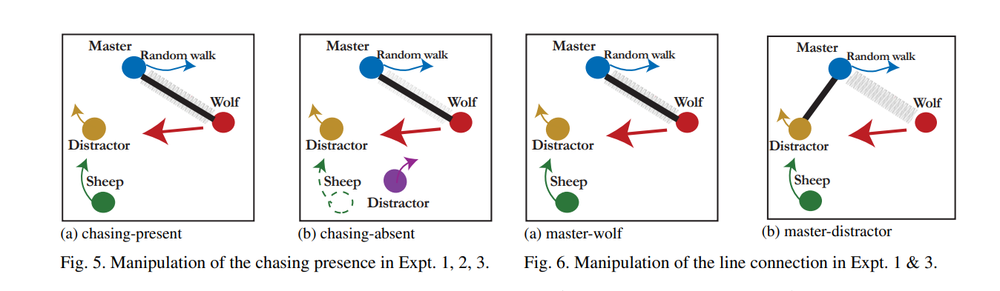
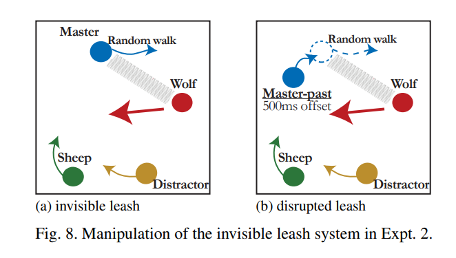
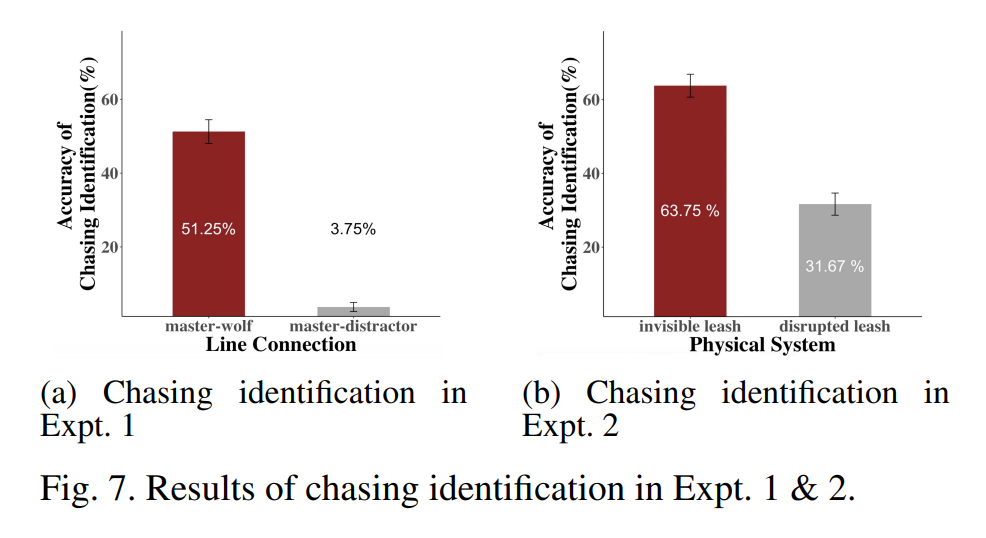
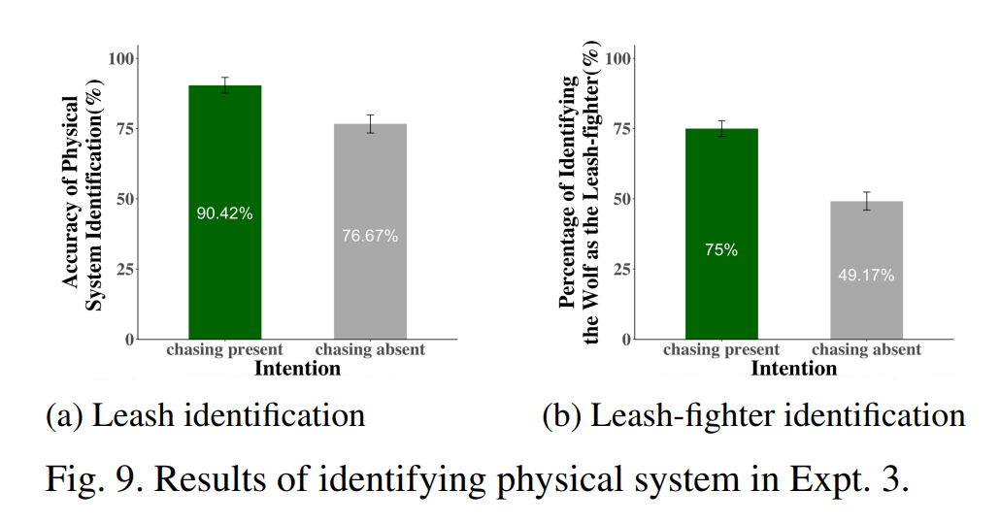

## 物理环境变化对 *追逐* 运动感知和预测的影响机制探讨
---
### 运动知觉文献综述

#### 研究变量

1. sudden direction and speed changes
   
2. synchronized motions
3. interactions with spatial contexts and other objects
4. apparent violations of Newtonian machanics.
5. etc

#### 面临的挑战

1. 用于研究运动感知的方法不想其他视觉领域那样严谨，不能数量化
   
2. 通过自由报告可能会导致高级认知过程的参与
   
3. 可能不同类型的运动感知（打斗、玩耍、跟随）由不同的线索触发，之前的研究未作单个线索是如何运作的研究

## 物理环境和心灵的联合感知：运动、力和意图（Jointly Perceiving Physics and Mind: Motion, Force and Intention）
---
### Introduction

- **Physics and Mind**: The document emphasizes that both physical constraints and mental states play crucial roles in motion perception.
- **Leash-Chasing Display**: It uses a visual display where a "wolf" disc chases a "sheep" disc, constrained by a leash attached to a "master" disc, to illustrate these concepts.
- **Joint Perception**: The study suggests that vision infers a combination of physics and mind to explain motions, proposing a joint perception theory.
- **Research Significance**: The findings aim to support the theory that vision can jointly infer physics and mind to robustly perceive motion despite spatial deviations or diminishing objecthood.

### Intuitive physics and intuitive psychology

#### Theory of Body

ToB makes a prediction that inanimate objects should move in observation of physical laws such as the conservation of energy. From this prediction, it  naturally follows that any object that violates this predication should be categorized as animate with an internal energy source. Since the theory is essentially based on the prediction of inanimate objects, we refer to ToB as the “weak” definition of agenct.

> limitations
>  - 物理环境不确定
 > - ToB 在很大程度上依赖于对内部力量和外部力量的严格区分。 事实上，世界上的力往往更加复杂。当主体作用于物理系统时，系统也会 "反作用 "回来。在追逐狗绳的例子中，当狗向前拉狗绳时，狗绳就会把它 "拉 "回来。拉回 "的力既不是来自内能（狗链当然是无生命的，没有内能用于自我推动），也不是来自外能（它来自狗链，而不是重力或风）。根据刚体动力学的物理学原理，它是一种 "约束 "力，用于平衡内力和外力，使运动不会破坏物理系统。如果不考虑这种力，就不可能对物理世界做出逼真的描述

#### Theory of Mind

Theory of Mind (ToM) suggests that humans areable to interpret observed motions in terms of their underlying mental states (Wellman, 1992; Gelman, Durgin, & Kauf-man, 1995; Leslie, 1995; Gergely, N ́adasdy, Csibra, & B ́ır ́o,1995; Saxe, Carey, & Kanwisher, 2004). ToM fundamentally differs from ToB in the way it concerns the unique properties of agency. Specifically, it explicitly predicts that agents should act rationally in pursuit of desires and intentions, given its beliefs. Here we refer to ToM as the “strong” criterion of agency.

### A Theory of Joint Physics-Mind Perception

$$
M\dot{v}+c=J^Tf+\tau
$$
> $c$ 全局环境的控制力
$\tau$ 主体（agent）特有的控制力，理论的核心，连接心灵的终点和物理的起点
$f$ 约束力（constraint force）
$J^T$ 约束矩阵（constraint matrix）

- The ultimate task of vision is to eventually jointly infer a combination of mental states  and  physical  systemsthat controls the forces for explaining the observed motions

- In fact, the mind node can be further broken downinto belief-desire-intention (Bratman et al., 1987), extending the general theory into a joint inference of multiple mental states together with physics. In the present paper, we focus on the perception of chasing as an intention, assuming that there is no uncertainty in belief (the wolf sees the whole dis-play) or desires (the wolf only desires to catch the sheep)

### Psychophysics Experiments

**task.1**: detect whether or not such a chase or leash system was present 
**task.2★**: If a chase or leash was indicated, they were asked to identify the corresponding agents engaged in the chasing or objects within the leash system.

#### Expt. 1: Perceiving leash chasing

**Result**: It was much higher in the master-wolf condition than the master-distractor condition (Fig. 7a, t(11) = 22.76, p < 0.001, Cohen’s d = 7.25)
**Tow implications**: 

- perceived chasing is not determined by the absolute value of chasing subtlety, but largely influenced by whether the subtlety could be explained by an intuitive physical constraint.
- line connection as a disruption of objecthood does not necessarily impair perceived chasing. 

#### Expt. 2: Perceiving chasing with an invisible leash

**Result**: Performance of chasing identification was much higher in the invisible leash condition than the disrupted-leash condition (Fig. 7b, t(11) = 5.81, p < 0.001, Cohen’s d = 1.49).

**implications**: 
- even when leash was not mentioned at all and there was no visual cue implying a leash, participants still spontaneously used the master’s motion to explain the wolf’s large chasing subtlety
- it was the presence of an intuitive physical system that improved perceived chasing

#### Expt. 3: Perceiving leash through chasing

### Conclusion

- A Theory of Joint Physics-Mind Perception. The core of this theory is to recognize the duality of the “control force”, which is the output of agency and the input to the equation of motion in physics. 
- perceived chasing can be more robust than previously expected in the context of an intuitive physical system.
- inferring control forces through perceived intention is also critical for identifying a physical system with constraint forces. 